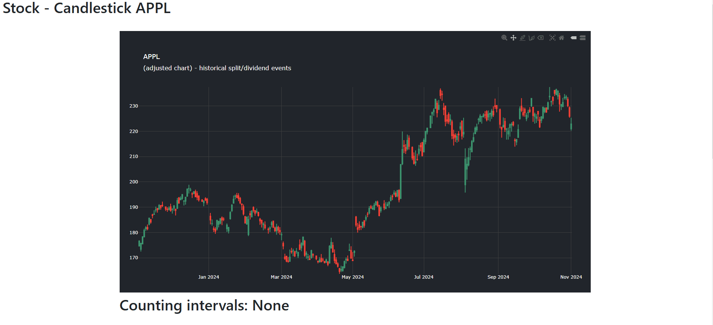

# Django-plotly-dash-candlestick-example

I am using ``django-plotly-dash`` to create a beautiful looking candlestick chart - https://github.com/GibbsConsulting/django-plotly-dash.

## Quick start

    git clone https://github.com/JAdelhelm/Django-plotly-dash-candlestick-example.git
    conda create --name django_env python
    conda activate django_env
    cd Django-plotly-dash-candlestick-example/
    pip install -r requirements.txt
    cd mysite
    python manage.py makemigrations
    python manage.py migrate
    python manage.py collectstatic
    python manage.py runserver

Open http://127.0.0.1:8000/

