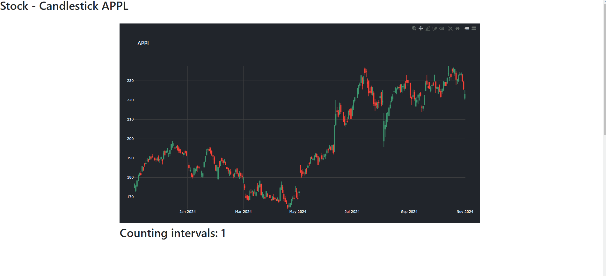

# Django-plotly-dash-candlestick-example

I am using ``django-plotly-dash`` to visualize candlestick charts - https://github.com/GibbsConsulting/django-plotly-dash.




## Quick start
``` bash
$ pip install -r requirements.txt
$ cd mysite
$ python manage.py makemigrations
$ python manage.py migrate
$ python manage.py collectstatic
$ python manage.py runserver
```
